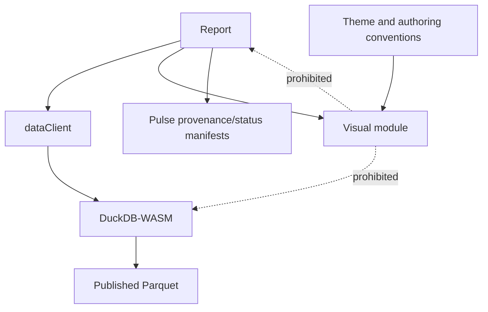
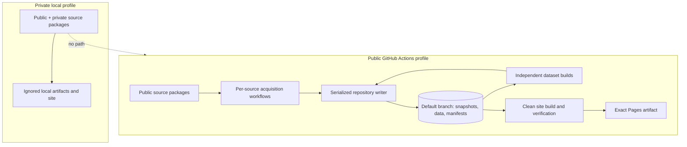

# Architecture Spine — Pulse

## Design Paradigm

Pulse is a pipes-and-filters system whose boundaries are immutable, versioned artifacts. A stage consumes declared artifacts and emits the next; no stage reaches through a boundary into another tool's mutable state. The browser is a terminal, read-only consumer.

```mermaid
flowchart LR
    O[Source origin] --> I[Source package acquisition]
    I --> S[Immutable snapshot + snapshot contract]
    S --> D[Independent dataset package transform and test]
    D --> P[Dataset Parquet + dataset contract]
    P --> B[Observable static build]
    B --> G[GitHub Pages artifact]
    G --> Q[Application dataClient / DuckDB-WASM]
    Q --> V[DOM/SVG visual]
```



## Invariants & Rules

### AD-1 — Static artifact pipeline [ADOPTED]

- **Binds:** FR-3, FR-5–FR-9, FR-18–FR-21, FR-26; all pipeline stages.
- **Prevents:** hidden mutable coupling, unreplayable warehouses, and browser-side writes.
- **Rule:** The only forward path is acquire → immutable snapshot contract/artifact → independent transform/test → dataset contract/Parquet plus status → static site artifact → browser query/render. Snapshots are never modified or deleted. Source acquisition ends after snapshot publication. Dataset packages rebuild independently from declared snapshots, and the whole-pipeline command rebuilds every eligible dataset before the site. Landing files or staging relations may exist inside a dataset build, but are disposable package-private implementation details rather than inter-package APIs. DuckDB databases and site output are likewise disposable and reproducible from the archive; no publication path incrementally mutates a prior dataset.

### AD-2 — Independent extension packages and artifact ownership [ADOPTED]

- **Binds:** FR-1–FR-9, FR-22–FR-24; every source epic.
- **Prevents:** an exemplar provider owning downstream analytical products, stages reaching into one another's code, and shared runtime accumulating provider or dataset special cases.
- **Rule:** Source, dataset, and report are independently discoverable package kinds. A `sources/<source-id>/` package owns provider access, faithful source-format decoding, source assertions, and the committed contract for the immutable snapshot it emits; it contains no analytical transformation, report-facing schema, or report logic. A `datasets/<dataset-id>/` package owns declared snapshot dependencies, analytical typing and semantics, dbt models/tests, disposable build state, committed dataset schema/metadata, and report-facing Parquet; it never invokes acquisition or imports source-package code. A `site/reports/<report-id>/` package owns queries, arrangement, interaction state, annotations, and declared dataset/column dependencies; it never reads snapshots. Packages communicate only through versioned snapshot and dataset artifacts. A v1 dataset declares exactly one source in its lineage, but its identity and ownership remain independent of that source. dbt-duckdb publication uses the shared proven external mechanism.

### AD-3 — Per-source isolation and advancement [ADOPTED]

- **Binds:** FR-2–FR-9, FR-19–FR-21; scheduled and on-demand source runs.
- **Prevents:** one source cadence or failure blocking unrelated sources, and a failed decode masquerading as fresh data.
- **Rule:** One independently scheduled, idempotent workflow owns each source through snapshot publication; dataset and site orchestration are downstream consumers selected from declared dependency graphs. The Pulse CLI creates one opaque, platform-independent acquisition ID for each logical scheduled or manually triggered observation and passes it through acquisition and snapshot publication. A retry reuses that ID: the repository writer no-ops when the ID and artifact hashes already match and fails on the same ID with different content. A later observation receives a new ID and is preserved even when its bytes match an earlier observation. Source declarations distinguish fetch cadence from expected publication advancement, and source freshness assertions use the latter. A missed schedule is recoverable by the next or an on-demand run. Contract-compliant snapshots advance even when source assertions mark them suspect, and their warning propagates through dependent datasets. Invalid snapshots remain archived when safe, emit fresh failed source status, and cannot replace a dependent dataset's last usable input. Other sources, datasets, and the site continue.

### AD-4 — Pulse-owned lineage and health contracts [ADOPTED]

- **Binds:** FR-5–FR-9, FR-16, FR-19–FR-21, FR-26; snapshots, datasets, reports, and homepage.
- **Prevents:** the site depending on dlt state, dbt internals, Actions APIs, or ambiguous provenance.
- **Rule:** Versioned Pulse manifests are the inter-stage API. `runtime/contracts/` owns their generic envelopes: UTF-8 JSON documents use well-known filenames, carry a schema ID and semantic version, and are strictly validated by every producer and consumer; unsupported major versions are rejected. Committed package contracts own provider- or dataset-specific schema and semantics. An immutable `snapshot.json` identifies source, acquisition, UTC acquisition time, source-data date, original files/URLs, SHA-256 content hashes, observed schema, decoder/tool versions, licence, and attribution, and its artifact is validated against the source package's committed snapshot contract. Generated `dataset.json` combines a committed dataset contract with measured output facts and references its selected snapshot manifest directly; the build rejects disagreement between declaration, data, and manifest. Dataset IDs are globally unique opaque lowercase kebab-case values and do not encode source ownership. Every browser entry in `browser-data.json` carries the dataset ID, unique logical DuckDB table name, contract version, schema, content hash, represented period, manifest-relative Parquet URL, semantic metadata, declared snapshot lineage, and resolved visibility. Reports reference only dataset IDs; `dataClient` alone resolves IDs to tables and URLs, always against the browser manifest URL rather than the current document route.

  Source, dataset, and `system/site` declarations form the complete expected-pipeline set and dependency graph. A source pipeline publishes replaceable status for canonical stages `acquire` and `snapshot`; a dataset pipeline publishes status for `transform`, `test`, and `publish-data`; site stages are `build-site` and `deploy-site`. Each projection records stable identity, execution time, canonical outcomes, latest usable output where applicable, and sanitized diagnostics. `system/site` writes its successful build/deploy projection only into the deployed site artifact; a failed replacement cannot update an already deployed static site, so the prior site's validity deadline expires to `stale` while GitHub Actions retains the failure diagnostic. A required stage that cannot emit a contract-compliant artifact is `failed`; a contract-compliant artifact with failed domain or freshness assertions is `suspect`; `stale` means its declared validity deadline passed. Display precedence is `failed > suspect > stale > succeeded`, with `not-run` used only before any attempt. The latest usable dataset is the newest contract-compliant publication, including a suspect one; a failed build does not replace it. Errors use one versioned sanitized envelope with stage, stable code, safe message, and retryability.

  Each `site/reports/<report-id>/report.yml` is the canonical report declaration and owns `requested_visibility`; the compiled `report-catalog.json` records requested and lineage-derived `resolved_visibility`, stable ID/name/route, and last substantive data-or-content change, never routine regeneration. Observable page metadata may mirror but never own these values. Each visual slot declares dataset/column dependencies; suspect impact is computed from that lineage and is conservatively `unknown/possibly affected` when column-level precision is unavailable. The site manifest records generation time and validity deadline. The site consumes only dataset and status contracts, never snapshots or package implementation code.

### AD-5 — Structural privacy propagation [ADOPTED]

- **Binds:** FR-4, FR-17, NFR-2–NFR-3; all source, dataset, report, and build units.
- **Prevents:** private data leaking through forgotten exclusions, credentials, derived reports, or build residue.
- **Rule:** Public inclusion is positive and lineage-based. Public CI can discover only public sources and receives no private credentials or roots; any dependency on a private source makes every downstream dataset and report private and invalidates a public build. A report may explicitly tighten itself to private in its report declaration but can never weaken inherited privacy. Manually supplied private files enter only through the ignored `private/inbox/<source-id>/` convention and the same Pulse acquisition command used by other sources; source code may not read arbitrary user paths. Private builds run locally in ignored, never-deployed roots. Public artifact scanning is defense in depth, not the privacy boundary.

### AD-6 — Observable site shell behind an exit seam [ADOPTED]

- **Binds:** FR-15, FR-18–FR-20, FR-25; homepage, reports, local serve, and GitHub Pages.
- **Prevents:** epics choosing incompatible site frameworks or embedding irreplaceable Observable protocols in application modules.
- **Rule:** Observable Framework is the v1 report-site substrate, conditional on an Observable-only pilot against freshly rechecked versions. The pilot must prove the real repository subpath, nested-route reload, representative same-origin Parquet query, keyboard operation, distinct DuckDB-WASM startup/query failures, one nontrivial interactive DOM/SVG visual, clean-clone reproduction, public artifact privacy, and measured cold time to first readable visual. Portable modules use explicit imports and application-owned manifest paths—never Observable implicit imports, generated paths, or globals—and the data client and visual must move unchanged into a minimal Vite shell. Failure of any exit criterion blocks implementation and reopens the site-substrate decision; it does not trigger an Evidence comparison by default.

### AD-7 — Report/query/visual dependency direction [ADOPTED]

- **Binds:** FR-10–FR-16, FR-25; every report and visual.
- **Prevents:** visuals coupling to SQL, storage, routing, Observable reactivity, or framework lifecycle.
- **Rule:** A report owns dataset selection, parameterized SQL, per-report exploration/cross-visual state, annotations, provenance plumbing, and routing; reader exploration is an explicit per-report opt-in while DuckDB-WASM remains the universal delivery path. The application shell creates one `dataClient` and shared DuckDB-WASM worker/connection for the loaded browser page session; reports borrow it across route changes and may never dispose it. The client alone owns manifest-based dataset registration, parameter binding, normalized startup/query errors, and request-scoped cancellation that does not terminate shared resources; only the application shell disposes it on page unload. It returns plain rows. Visual contract major `v1` defines declared-schema fixtures, rows/display/provenance inputs, registration, and consumer-schema validation; every report slot accepts that major only. A breaking major requires one atomic migration or an application-owned compatibility adapter and cannot be introduced by an individual visual. A visual is authored against fixture rows before a coding agent substitutes the real query; its rendering logic is unchanged and returns DOM/SVG. It knows no SQL, DuckDB, Parquet path, Observable global/protocol, or route. Each report visual slot independently contains loading, no-row, query-error, schema-incompatibility, and render-error states so siblings remain usable; only shared engine/data-delivery failures escalate to report scope. Visuals expose cleanup only for resources outside their returned DOM subtree.



### AD-8 — One automation API and one repository writer [ADOPTED]

- **Binds:** FR-2–FR-6, FR-18, FR-22–FR-24, NFR-1–NFR-2; local runs, agents, and GitHub Actions.
- **Prevents:** pipeline logic diverging across YAML/scripts and concurrent workflows corrupting default-branch history.
- **Rule:** One repository-local Pulse CLI is the high-level API for independent source acquisition, independent dataset builds, whole-pipeline rebuilds, profile selection, verification, site build, and one-command local serving; local execution, agents, and thin reusable Actions workflows invoke it identically. Repository-owned instructions cover add source, add dataset or indicator, add visual, add report, and change dataset schema; each starts from a neutral template and is validated by fixtures plus at least one complete working implementation. Working implementations are conformance evidence, never scaffolds to copy. Repeated behavior moves into the shared runtime only when it is package-neutral; shared code may not name exemplar providers, series, datasets, or columns. Computation may run concurrently, but every default-branch mutation passes through one shared-concurrency repository-writer job that starts from the current default branch and atomically commits an artifact-scoped change set. Site builds do not mutate the default branch and use a separate latest-wins concurrency group.

### AD-9 — Layer-specific conformance before exemplar verification [ADOPTED]

- **Binds:** FR-1, FR-6, FR-9–FR-12, FR-18, FR-22–FR-24, NFR-1–NFR-3; all extension workflows.
- **Prevents:** package kinds inventing incompatible test shapes, a generic runtime that is secretly exemplar-specific, and CI depending on upstream availability.
- **Rule:** Every source passes an offline fixture-based source suite covering deterministic acquisition/decoding, snapshot-contract completeness, schema drift, release-calendar freshness, archive integrity, and profile privacy. Every dataset separately passes an offline dataset suite covering snapshot-only replay, committed contract completeness, analytical schema and semantics, data tests, deterministic publication, lineage, and consumer compatibility. A neutral synthetic source/dataset pair proves discovery and orchestration without exemplar code. Provider live tests are explicit and opt-in but at least one real integration check is an acceptance gate for the first provider and remains part of scheduled verification. Visual contract tests use declared-schema fixture rows and detect consumer breakage. Playwright covers a multi-visual nested report in which one slot fails while siblings remain usable, reload, keyboard/accessibility behavior, DuckDB-WASM startup/query failures, and public artifact scanning.

### AD-10 — Locked runtimes and immutable deployment [ADOPTED]

- **Binds:** FR-3, FR-6, FR-18, FR-26, NFR-2, NFR-4, NFR-6; development, CI, and deployment.
- **Prevents:** scheduled dependency drift, verification/deployment mismatch, and generated-site history polluting the archive.
- **Rule:** Python 3.13 uses uv/`uv.lock`; Node 24 LTS uses npm/`package-lock.json`. The Stack table is a cold-start compatibility seed, not permission for independent “latest” upgrades: the first implementation change must create both lockfiles and pass one clean-install CLI/dbt/DuckDB/Observable build smoke test before the tuple is ratified; thereafter the lockfiles are authoritative. The dbt smoke covers version/debug, parse/build/test, external Parquet materialization, `ref()`, and both passing and failing `not_null`; the browser pilot refreshes DuckDB-WASM and runs shared type/query fixtures against Python and WASM engines. CI performs frozen installs; dependency upgrades are explicit tested changes and never part of ingestion. Public raw snapshots use Git LFS as the deliberately simple v1 archive; raw-consuming jobs explicitly fetch only their source's LFS objects, materialize them, and reject pointer stubs before decoding. LFS usage is observed, not treated as a permanent free-tier guarantee; if storage or bandwidth becomes material, the archive substrate is revisited without changing snapshot immutability. The default branch stores code, immutable public snapshots, published dataset Parquet, and Pulse manifests—not generated site files. A clean workflow verifies one site artifact, fails before GitHub Pages' 1 GB published-site limit, and deploys that exact artifact; browser-readable Parquet sits under the site root. Browser DuckDB uses the single-threaded EH bundle without special headers; `coi-serviceworker` is prohibited unless profiling later justifies a host/threading architecture change. Actions and Pages usage is watched at provider boundaries.

### AD-11 — Purpose-built visual experience floor [ADOPTED]

- **Binds:** FR-10–FR-14, FR-18, NFR-6; every visual, report shell, and authoring workflow.
- **Prevents:** independently built visuals introducing chart grammar, inaccessible interaction, incompatible sizing, or hardcoded theme behavior.
- **Rule:** No visual or rendering layer may import or call a chart/visualization library; an unused transitive dependency does not violate the rule. `site/design/tokens.css` and `site/design/visual-language.md` are the application-owned presentation contract: the former owns dark-default theme, type, spacing, state colors, focus, and reduced-motion signals; the latter owns minimal cross-visual authoring conventions and is consumed by the add/change-visual workflow. Visuals consume existing semantic roles. Adding or changing a shared role requires cross-report conformance review and must not force mass visual rewrites. Every visual meets WCAG 2.2 AA through semantic structure, keyboard operation, visible focus, non-color-only states, contrast, zoom/reflow, adequate targets, reduced motion, and an accessible data equivalent. Visuals own container-responsive rendering and remain readable on narrow smartphone landscape; advanced controls may simplify, but the indicator and provenance remain available.

## Consistency Conventions

| Concern | Convention |
| --- | --- |
| Identity | Stable lowercase kebab-case source, dataset, and report IDs independently key packages and artifact roots. Dataset IDs are globally unique opaque values and do not encode source ownership; visual-slot IDs are `<report-id>/<slot-id>`; source pipeline IDs are `source/<source-id>`, dataset pipeline IDs are `dataset/<dataset-id>`, and system IDs reserve `system/*`. Report routes and logical DuckDB table names are globally unique. Contract/catalog generation fails on every ID, table, or route collision. Snapshot IDs combine acquisition ID with a short SHA-256 prefix; all derived manifests carry declared lineage. |
| Time | Machine timestamps are UTC ISO 8601; source-data dates remain separate from acquisition and build times. |
| Data | Original file bytes are immutable; non-file source snapshots and report-facing data are Parquet. Datasets are wide and documented; annotations are data, never hardcoded coordinates. Dataset-private staging may use Parquet but is not an inter-package API. |
| Schema drift | Record every observed schema. Allow and report compatible additions; flag missing required fields and incompatible types; fail only when faithful decoding is impossible. |
| State | Immutable source history advances by new artifacts and Git commits. Per-source current-status projections are replaceable through the repository writer; the successful `system/site` projection exists only in the deployed artifact and expires when not replaced. dlt state, DuckDB files, generated sites, and Actions APIs are never data or lineage authorities. |
| Configuration | Source declarations contain no secrets. Credentials enter only through the executing profile/environment and never appear in manifests, logs, repository artifacts, or the browser. |
| Browser errors | No rows and query failure are visible, distinct report states; neither produces a blank visual. |
| Public archive | Raw public snapshots are Git LFS objects; published report Parquet and site output are not placed in LFS unless a later measured constraint requires it. |
| Presentation | English-only v1; shared dark-default semantic tokens; restrained motion with `prefers-reduced-motion`; exact report visual design remains report-specific. |

## Stack — cold-start compatibility seed (checked 2026-08-18)

| Name | Version |
| --- | --- |
| CPython | 3.13 line; current patch at lock generation (3.13.14 research seed) |
| uv | current patch at lock generation (0.12.1 research seed) |
| dlt | 1.30.0 |
| dbt-core | 1.12.2 |
| dbt-duckdb | 1.10.1 |
| DuckDB (Python) | 1.5.5 |
| Node.js | 24 LTS; current patch at lock generation |
| npm | version bundled with selected Node 24 patch |
| Observable Framework | 1.13.4 |
| DuckDB-WASM | pilot-selected current stable (1.31.0 research candidate) |
| GitHub Actions / Pages | hosted service contract as verified 2026-08-18 |

## Structural Seed

```text
sources/<source-id>/
  source.yml          # identity, cadence, privacy, licence, attribution
  acquire.py          # provider access and faithful source decoding
  snapshot-contract.yml # committed source-native schema and assertions
  fixtures/           # provider response fixtures
  tests/              # source acquisition/snapshot verification

datasets/<dataset-id>/
  dataset.yml         # identity, snapshot dependency, build entry point
  dataset-contract.yml # committed report-facing schema and semantics
  dataset-contract.md # formulas, alignment, provenance, limitations
  dbt/                # dataset-owned staging, models, and tests
  fixtures/           # representative output/edge cases
  tests/              # snapshot replay and dataset conformance

snapshots/<profile>/<source-id>/<snapshot-id>/  # immutable originals + manifest
build/datasets/<profile>/<dataset-id>/            # disposable package-private build state
publish/<profile>/data/<dataset-id>/              # report-facing Parquet + dataset.json
publish/<profile>/status/source/<source-id>.json # replaceable source projections
publish/<profile>/status/dataset/<dataset-id>.json # replaceable dataset projections
private/inbox/<source-id>/                        # ignored manual private-source input
runtime/contracts/                                # sole owner of versioned JSON schemas
runtime/                                           # Pulse CLI and conformance suite
workflows/                                         # five neutral extension/change templates + conformance evidence
site/
  catalog/                                         # compiled browser-data/report/pipeline contracts
  design/                                          # shared tokens and minimal visual-language contract
  reports/                                         # queries, visual slots, controls, metadata dependencies
  visuals/                                         # framework-neutral DOM/SVG modules and fixtures
  data/                                            # dataClient and browser-manifest adapter
```



## Capability → Architecture Map

| Capability / Area | Lives in | Governed by |
| --- | --- | --- |
| Source declaration, cadence, public/private acquisition | `sources/<source-id>/`, snapshot contracts, Pulse CLI, per-source Actions | AD-2, AD-3, AD-5, AD-8 |
| Immutable archive and full replay | `snapshots/`, snapshot manifests | AD-1, AD-2, AD-4, AD-9 |
| Source-native decode and assertions | source adapters and snapshot contracts | AD-2, AD-3, AD-9 |
| Wide documented datasets and analytical tests | `datasets/<dataset-id>/`, dataset-owned dbt, published Parquet/manifests | AD-1, AD-2, AD-4, AD-9 |
| Visual authoring and report composition | `site/` reports, `dataClient`, DOM/SVG modules | AD-6, AD-7, AD-9 |
| Browser exploration and static delivery | DuckDB-WASM, Observable build, Pages artifact | AD-6, AD-10 |
| Freshness, suspect data, pipeline visibility | expected-pipeline declarations, status projections, homepage/report adapters | AD-3, AD-4, AD-7 |
| Agent-legible extension workflows | independent package templates, repository workflow instructions, Pulse CLI, layer-specific conformance suites | AD-2, AD-8, AD-9 |
| Accessible, responsive, dark-default presentation | shared tokens, visual contract, report slots | AD-7, AD-9, AD-11 |

## Deferred

- Story 1.2 pilot budget (updated 2026-09-01): cold page load <= 5 seconds and time to first readable visual <= 10 seconds under clean locked install, cold-cache build, and direct nested-route load. The original fixture baseline observed cross-browser maxima of 116 ms and 2,343 ms; the expanded allowance supports complete real INSEE CPI history through the Visual Contract. Re-measure against the production report in Story 1.9.
- Choose cross-filtering and per-report versus per-visual query topology only when a report requires shared interactive state.
- Choose each unusual-format parsing library inside its source package; promote it to shared runtime only after a second source needs the same package-neutral behavior.
- Tune Parquet partitioning, compression, and row groups against real dataset sizes; target the PRD's roughly 5–50 MB browser-facing files first.
- Add durable private-archive backup before private history becomes material; v1 local-only private storage remains an accepted risk.
- Revisit the public raw-archive substrate only if observed Git LFS storage or bandwidth becomes material; v1 intentionally does not add object storage, retention tiers, or migration machinery pre-emptively.
- Reconsider Evidence only through an explicit architecture update if its `next` line becomes a released, sustained, contribution-friendly default and Observable fails its pilot or exit seam.
- Multi-source datasets are outside v1; dataset identity and package ownership are already source-neutral, but introducing multiple source dependencies must revisit selection consistency and privacy/status propagation.
- If the dbt-duckdb external-model smoke test fails, choose and record one shared publish fallback before implementing source epics; per-source export variants are prohibited.
